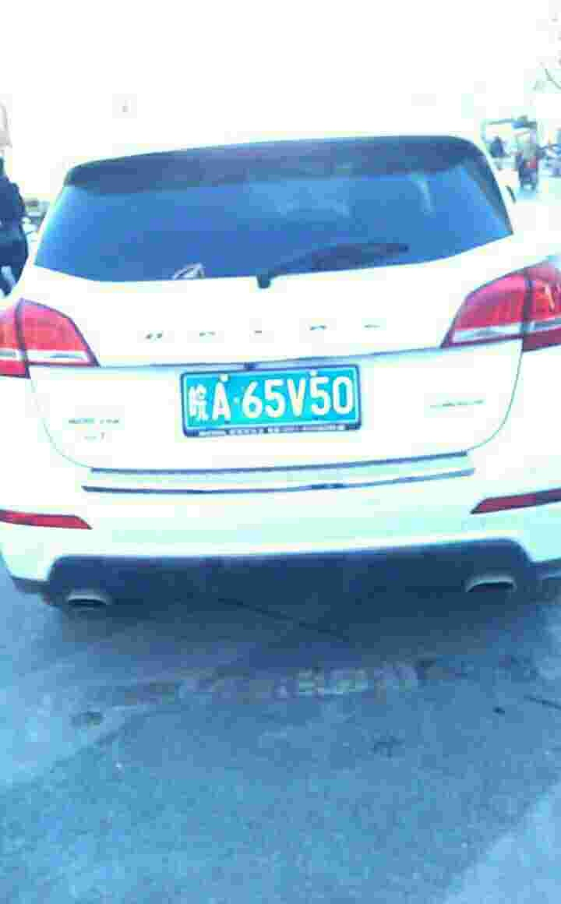
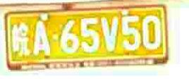
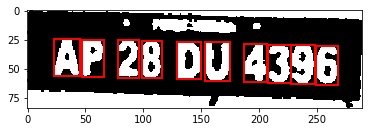

# Number Plate Detection System
Number Plate Detection has been made for the purpose of security purposes. This System tracks an ongoing car and separates the number plate from the car and save its digits. This system has been implemented with number of approaches and ways. In this repo we are using YOLONet, Convolutional Networks and OCR(from openCV ) to implement this system.

# Requirements
- [PyTorch](https://pytorch.org/) (An open source deep learning platform) 
- [OpenCV](https://opencv.org/) ( a highly optimized library with focus on real-time applications.)

# Sample Frames being Processed For Output


# In a Nutshell
In a nutshell here is how we have implemented this project
- In `vehicle-detection` folder there is a file `final.py` on extecuting this file the video taken as input is converted into snapshots and `YoloNet` detects the vehicles from the frame.The Frame with vehicles in the output are are saved in the folder `vehicle-detection/output`

#### To run vehicle detector open terminal in the directory

Run the command:
```sh
python final.py
```
#### The sample snapshot of detected Vehicle Can be seen below


- In `palate_localization` folder we have implemented the Convolutional Neural Network For Palate LocaliZation. The trained model has been saved as `model.pth` file.To train the model again place the data in `palate_localization/photos` folder.
The train data can be found from the link below:
### The google drive link for directly downloading the whole dataset: [google drive 12GB](https://drive.google.com/open?id=1fFqCXjhk7vE9yLklpJurEwP9vdLZmrJd). 
## Dataset Annotations

Annotations are embedded in file name.

A sample image name is "025-95_113-154&383_386&473-386&473_177&454_154&383_363&402-0_0_22_27_27_33_16-37-15.jpg". Each name can be splited into seven fields. Those fields are explained as follows.

- **Area**: Area ratio of license plate area to the entire picture area.

- **Tilt degree**: Horizontal tilt degree and vertical tilt degree.

- **Bounding box coordinates**: The coordinates of the left-up and the right-bottom vertices.

- **Four vertices locations**: The exact (x, y) coordinates of the four vertices of LP in the whole image. These coordinates start from the right-bottom vertex.

- **License plate number**: Each image in CCPD has only one LP. Each LP number is comprised of a Chinese character, a letter, and five letters or numbers. A valid Chinese license plate consists of seven characters: province (1 character), alphabets (1 character), alphabets+digits (5 characters). "0_0_22_27_27_33_16" is the index of each character. These three arrays are defined as follows. The last character of each array is letter O rather than a digit 0. We use O as a sign of "no character" because there is no O in Chinese license plate characters.
```
provinces = ["皖", "沪", "津", "渝", "冀", "晋", "蒙", "辽", "吉", "黑", "苏", "浙", "京", "闽", "赣", "鲁", "豫", "鄂", "湘", "粤", "桂", "琼", "川", "贵", "云", "藏", "陕", "甘", "青", "宁", "新", "警", "学", "O"]
alphabets = ['A', 'B', 'C', 'D', 'E', 'F', 'G', 'H', 'J', 'K', 'L', 'M', 'N', 'P', 'Q', 'R', 'S', 'T', 'U', 'V', 'W',
             'X', 'Y', 'Z', 'O']
ads = ['A', 'B', 'C', 'D', 'E', 'F', 'G', 'H', 'J', 'K', 'L', 'M', 'N', 'P', 'Q', 'R', 'S', 'T', 'U', 'V', 'W', 'X',
       'Y', 'Z', '0', '1', '2', '3', '4', '5', '6', '7', '8', '9', 'O']
```

- **Brightness**: The brightness of the license plate region.

- **Blurriness**: The Blurriness of the license plate region.

#### open terminal in directory and run the command after placing the train data to train network again

```sh
python train.py
```
The Model used can bee seen ih the file `model.py`.
```python
        self.features = nn.Sequential(
            hidden1,
            hidden2,
            hidden3,
            hidden4,
            hidden5,
            hidden6,
            hidden7,
            hidden8,
            hidden9,
            hidden10
        )
        self.classifier = nn.Sequential(
            nn.Linear(63360, 100),
            # nn.ReLU(inplace=True),
            nn.Linear(100, 100),
            # nn.ReLU(inplace=True),
            nn.Linear(100, 12),
        )
```
#### open terminal in directory and run the command below to see te working of palate Localization
```sh
python predict.py
```
#### The sample of the localized plate can be seen below:


- In the `predictCharacter` folder we have implemented the character predictor from scratch using `OpenCv`.To run the character predictor place the sample in the folder `predictorCharacter/output`  with the name `frame-1` and open terminal here and run the `PredictCharacters.py`.

#### The sample of output from the `predictCharacter` can be seen below


To run the entire project in one go run the file `initialize.py`
#### Run the following command in terminal
```sh
python initialize.py
```
Note: cuda is compulsory to run the above neural network
# Future Work
Trying to make the system autonomous on live video and increasing the accuracy of the Convolutional Neural Network.
# Contributing
Any kind of enhancement or contribution is welcomed.
